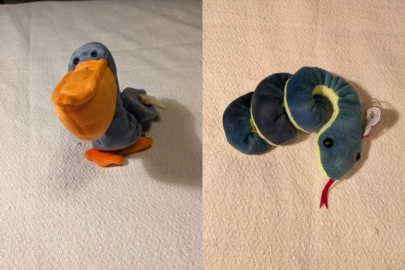

# GPT Image Compare
Docs 1-22-24 V1 (For questions or comments:  Stephen Witty switty@level500.com)  

### Project Overview:
This project seeks to measure the ability of ChatGPT 4 Vision to identify objects in an image as either the same object or a different object.  This includes the same object in different front-facing orientations.   The project implements an automated approach of selecting random images from a source pool, combining the images, and then submitting them to ChatGPT to determine if the two objects in the image are either the same or different.  The resulting reply from ChatGPT is then evaluated to determine if the answer is correct.  Statistics are kept over multiple test runs and reported at the testing conclusion.  Sample results can be found in the below presentation along with a video with a sample execution.
  

### Reports / Documentation:
- A presentation that covers the project can be found below:
- [Presentation Link](https://github.com/switty42/GPT_Image_Compare/blob/main/Presentations/GPT_Image_Compare_012224.pdf)
- Example run recorded:
- [Video](https://youtu.be/BNX-2QrPaC8)

### Usage:

- The software is a Python3 script and runs in the usual manner
- The script has been tested on Ubuntu
- Install the OpenAI Python lib (see OpenAI website for instructions)
- The ImageMagic package is needed for the convert command
- Install the package with the banner Linux command
- Place your own OpenAI API key toward the top of the Python script
- Edit the program constants as needed at the top of the Python script
- Copy source photos into PIC_DIR (find sample photos in this repository)
- The script determines if a group of photos are the same object by file name convention
- For matching objects, the first character of the file name should be the same
- DO NOT place a photo named pic.jpg into the PIC_DIR. This name is used as a temp working name